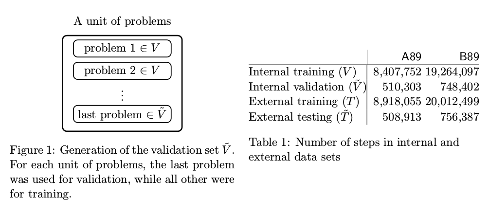
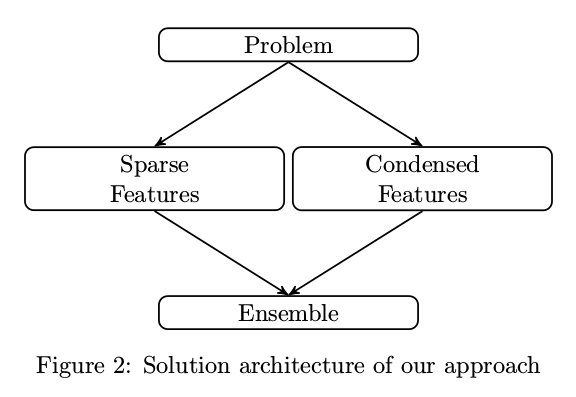

# Feature Engineering and Classifier Ensemble for KDD Cup 2010

本文旨在学习特征工程.

原文链接[Feature Engineering and Classifier Ensemble for KDD Cup 2010](http://pslcdatashop.org/KDDCup/workshop/papers/kdd2010ntu.pdf)

## 0. 摘要

KDD Cup 2010 是一个教育性质的数据挖掘比赛. 要求参赛者根据学生过去的学习表现学习一个模型, 来对将来的学习表现做出预测. 在国立台湾大学, 我们为 KDD Cup 2010 组织了一门课程. 大多数学生子团队通过各种二值化(binarization)和离散化(discretization)技术扩充特征. 采用 Logistic Regression(using **LIBLINEAR**)来训练稀疏特征集合(sparse feature sets). 一个学生子团队采用简单的统计技术和随机森林(through **Weka**)来训练浓缩特征(condensed features). 在最初开发时, 将训练集划分为训练集和验证集用来训练和验证. 我们识别出一些有用的特征组合来提高模型的性能. 我们通过 Regularized Linear Regression 来整合学生子团队的结果用来得到最终的提交结果. 我们的团队是 KDD Cup 2010 的冠军.

**关键字: Educational Data Mining, Feature Engineering, Classifier Ensemble, Linear Classification, Logistic Regression, Random Forest**

## 1. 简介(Introduction)

KDD Cup 2010 是一个教育性质的数据挖掘比赛, 参赛者被要求根据学生以往的解代数问题的表现来预测学生现在的表现. 该预测任务对于研究者们是一个技术挑战, 同时也具有重要的实际意义, 例如: 精确的预测结果能够用来更好的理解学生的学习过程, 进而对学习过程给出指导建议.

具体说来, 给参赛者提供学生与智能辅导系统互动日志的总结. 可获得的数据集是: `algebra_2008_2009`和`bridge_to_algebra_2008_2009`. 在本文接下来的部分中, 我们分别称这两个数据集为: `A89`和`B89`. 每一个数据集包含大量交互步骤的日志. 在`A89`中包含8,918,055个步骤, `B89`中包含20,012,499个步骤. 训练集和测试集中同时包含了互动日志中的一些域, 例如: `student ID`, `step name`, `problem name`, `unit name`, `section name`, 也包含该代数问题中使用的知识(Knowledge Components, KC)和该题被浏览的次数. 然而, 一些日志域仅仅出现在训练集当中: 是否为首次作答成功(correct on the first attempt, CFA), 提示的次数(hint)以及该步骤信息.

比赛将`CFA`作为分类任务的标签, 0表示首次作答失败, 1表示首次作答成功. 带有`CFA`的训练集用来训练, 不带`CFA`的测试集用来模型评估. 我们分别称训练集和测试集为:  $T$ 和 $\widetilde{T}$. 使用均方差的平方根(Root Mean Squared Error, RMSE)作为评价指标. 在比赛中, 参赛者提交测试集的预测结果到网页服务器中, 然后服务器取测试集的一部分计算RMSE用来公开显示. 显示参赛者成绩的网页称为: "leader board".

在国立台湾大学, 我们为 KDD Cup 2010 组织了一门课程. 我们的成员包括: 3名教员, 2名助教, 19名学生和1名助研. 所有学生被分为6个子团队. 每周每个子团队展示他们的进展, 并参与和其它子团队的讨论. 助教帮助营造一个内部的竞争氛围, 这样每个子团队可以在上交结果之前尝试他们的想法.

一开始我们认为今年的比赛与往年有很大不同. 对于该任务, 领域知识似乎十分重要. 实际上, 教育性质的数据挖掘是一个完整研究领域, 需要用专用模型和技术来处理独特的数据.

与往届 KDD Cups 相比, 特征的含义已经给出, 这意味着特征工程将是一个重要环节. 而且, 时间信息变得重要, 因为在日志被记录的同时, 学生也通过学习获得了提高. 这一特性使得与传统的基于数据独立性假设的任务有所不同. 有趣的是, 在尝试了一些时间方法(例如: 贝叶斯网)以后, 我们发现用向量空间模型包含有用信息然后训练一个传统分类器这样会更容易. 因此, 现在我们的注意力转移到了利用领域知识, 时间信息等来辨认有用的特征.

接下来的部分详细描述了我们的解决方案. Section 2 对我们采用的方法的架构进行了概述. Section 3, 4 聚焦于多样化的特征工程. Section 5 讲解模型集成技术. Section 6 展示我们的实验结果. Section 7 对全文进行了小结.

## 2. 一些初始化设置和我们的方法(Some Initial Settings and Our Approach)

该小节讨论了验证集的使用, 并介绍了我们的解决方案的架构.

### 2.1 验证集的生成(Validation Set Generation)

因为比赛的原因, 参赛者更喜欢刷新 "leader board" 上的分数. 为了防止过拟合, 我们将训练集 $T$ 分成两部分, 一部分作为训练集 $V$, 另一部分作为测试集 $\widetilde{V}$.

当选择生成验证集的方法时需要特别注意, 因为有些方法仅仅适用于当某些标准满足时的情况. 例如: 交叉验证是文本分类问题中常用的方法. 然而, 对于该任务, 由于数据的时间特性, 交叉验证可能并不合适. 为了使生成的验证对 $(V, \widetilde{V})$和原训练测试集对$(T, \widetilde{T})$有相同的分布, 我们取 $T$ 中每个单元的最后一个问题作为 $\widetilde{V}$, 将剩余部分作为 $V$. Figure 1显示了一个单元的数据划分. 划分过程与生成 $T$, $\widetilde{T}$一样. Table 1显示`A89`和`B89`中验证集的大小.

### 2.2 解决方案的架构(Architecture of Our Solution)

因为数据点之间存在时间关系, 首先我们尝试了贝叶斯网. 然而, 我们发现用数据样本的独立向量来包含信息, 并训练一个传统的分类器更加容易. 因此, 主要任务变为提取有用特征, 然后应用合适的分类器. 我们的方法可以被分成以下步骤: 首先, 每个学生子团队根据他们对数据的分析和理解提取不同的特征, 然后选择不同的分类器来学习. 特征工程能够被划分为两种类型: 基于二值化(binarization)和离散化(discretization)的稀疏特征集(sparse feature sets), 基于简单统计量的浓缩特征集(condensed feature sets). 最后, 我们对子团队结果应用集成方法. 整个流程见图 Figure 2. 每个步骤的详细描述在后文展开.

## 3. 特征工程: 稀疏特征(Feature Engineering: Sparse Features)

我们的方法是将学生互动日志转换为稀疏特征向量然后应用线性分类器, 本节我们详述该方法.

### 3.1 基本稀疏特征(Basic Sparse Features: Our Baseline Setting)

一些基本且重要的特征能够被分为两类: `student name`, `unit name`, `section name`, `problem name`, `step name`和`KC`是类别特征, 而`problem view`和`opportunity`是数值特征.

我们选择将类别特征转换成二值化特征的集合. 例如: 在 `A89` 中有 3,310 个学生, 则特征向量包含 3,310 个二值化特征来指示每个学生是否完成该问题. 对于数值特征, 由于取值范围不同, 我们使用不同的放缩方法. 一种简单的方法是线性放缩每个数值特征至$[0, 1]$范围. 我们也考查了非线性放缩方法, 在生成 Figure 3 时, 我们考虑了 $log(1+x)$.

通过以上流程, `A89`和`B89`的特征数分别大约是1,000,000和200,000. 由于类别特征的扩充, 每个样本实例包含极少的非零元素, 所以数据集是非常稀疏的. 尽管6个学生子团队中的5个都采用了该特征扩充方法, 但是他们的基线实现(baseline implementation)与上述稍微有所不同. 他们可能仅仅使用了所有特征的一个子集, 或者对数值特征使用了不同的放缩方法.

### 3.2 特征组合(Feature Combination)

由于训练集的尺寸太大, 训练过于耗时的非线性分类器(例如: 核方法)可能就不是一个理想的解决方法. 可代替的是线性分类器, 详情见 Section 3.5. 然而, 线性分类器不具备能力发掘特征间可能存在的依赖关系. 与核方法中的多项式映射或者自然语言处理中的 bigram/trigram 类似, 我们可以使用特征组合来指示特征间的关系. 因为所有的特征含义都是已知的, 我们可以手动挑选出一些有用的特征对. 例如: 层级信息能够通过指示下列特征对的出现被包含进特征: (`student name`, `unit name`), (`unit name`, `section name`), (`section name`, `problem name`)和(`problem name`, `step name`). 除了两个特征的组合以外, 我们还可以尝试多个特征的组合. 在 Section 6 中的结果表明特征组合有效提升了性能.

### 3.3 时间特征(Temporal Features)

因为学生的学习能力随时间提升, 所以时间信息应该被考虑在内. 这里有一些成熟的技巧, 使用与传统分类问题非常不同的特征来表示学生的潜在属性(such as knowledge tracing and performance factor analysis). 我们考虑使用一种简单且常见的方法来将时间信息嵌入特征向量中. 对于每个步骤, 来自前几个步骤的`step name` 和`KC`被添加作为特征.

### 3.4 生成特征的其它方法(Other Ways for Generating Features)

在比赛期间, 我们尝试了很多其它的方法来生成特征. 这里我们描述其中的一些.

对于 Section 3.1 中的基线设置(baseline setting), 我们遵循比赛官网中"数据格式"页面的建议: 用"~~"来分隔`KC`字符串得到`KCs`. 然后用二值化特征指示与每一步骤相关的`KCs`. 然而, 这种做法导致很多相似的`KCs`. 例如: "Write expression, positive one slop"和"Write expression, positive slope"表示相似的概念, 但是被视为不同. 为了解决这个问题, 我们标记了`KC`字符串, 并将每个标记作为一个二值化特征.  例如: 一个`KC`"Write expression, positive slope"将会产生四个特征, "Write", "expression", "positive" 及 "slope" 都为真. 我们的经验表明这种用来生成`KC`特征的方法对于数据集`A89`很适用. 我们也使用了诸如正则表达式匹配的方法来解析知识组件(Knowledge Component, KC), 但是没有获得比基线设置更好的结果.

对于`problem name`和`step name`, 我们试图通过聚类来将相似的名字分组. 例如: 两个步骤的名字"$-18+x=15$"和"$5+x=-30$"仅仅在于常数不同, 所以它们可以被看做相同类型的步骤. 这种方法在不降低性能的前提下, 有效减少特征的个数. 大多数的学生子团队使用了该方法. 我们也试图将学生已学得的知识考虑到模型中, 因为一个学生的表现可能依赖于他是否以前遇到过同样的问题, 我们添加了特征来表示该信息. 结果表明该信息的添加轻微提升了模型性能.

先前, `problem view`被看做数值特征. 在一些情况下, 我们将该特征视为类别特征并二值化. 这样做可能是因为在训练集和测试集中并不存在很多个`problem view`值. 一个学生子团队验证这种修改轻微提升了模型性能.

### 3.5 线性分类和概率输出(Linear Classification and Probability Outputs)

在我们的分类过程中, 对于每一个步骤我们提取一个稀疏特征向量$x_i$, 并使用`CFA`作为标签$y_i$.

$$\begin{eqnarray} y= \begin{cases} 1& if CFA=1 \\ -1 & if CFA=0 \end{cases} \end{eqnarray}$$

因此, 我们假设训练集包括 $(x_i, y_i), i = 1, ..., l$. 由于向量 $x_i$的维度很高, 所以我们仅仅考虑线性分类器. 具体的, 我们使用 Logistic Regression, 概率模型如下:

$$P(y\vert x) = \frac{1}{1+exp(-y\omega^T x)}$$

接下来 Regularized Logistic Regression 解决如下优化问题:

$$\min_\omega \frac{1}{2}\omega^T \omega + C\sum_{i=1}^l log(1+e^{-y_i \omega^T x_i})$$

这里, $\omega^T \omega / 2$是 L2正则化项, $C$是惩罚参数. 一旦得到$\omega$, 决策函数就是:

$$\begin{eqnarray} sgn(\omega^Tx)= \begin{cases} 1& if \omega^Tx > 0 \\ 0 & otherwise \end{cases} \end{eqnarray}$$

L2正则化项会得到一个稠密向量 $\omega$, 所以我们也考虑了 L1正则化项来获得一个稀疏向量 $\omega$:

$$\min_\omega \Vert{\omega}\Vert_1 + C\sum_{i=1}^l log(1+e^{-y_i \omega^T x_i})$$

我们提交标签 $sgn(\omega^Tx)$或者概率值 ${1}/{(1+exp(-\omega^Tx))}$作为我们的预测结果. 结果表明使用概率值能够获得更小的 RMSE. 我们能够很容易的解读这个结果. 假设 $p$ 是预测概率值, 且 true label 是 0. 对于一个预测错误的样本, 预测误差和概率值分别是: $1$ 和 $(1-p)^2$; 对于一个预测正确的样本, 预测误差和概率值分别是: $0$ 和 $p^2$.

在我们开发时, 我们使用一个大规模线性库 **LIBLINEAR**, 该库能够有效训练非常大的数据集. 对于包含超过20,000,000个样本, 30,000,000个特征的`B89`数据集, 该库仅仅需要大约一小时的时间来训练.

我们也尝试了 **LIBLINEAR** 库中的线性SVM模型, 但是结果比 Logistic Regression 稍差一些.

## 4. 特征工程: 浓缩特征(Feature Engineering: Condensed Features)

